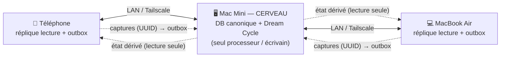
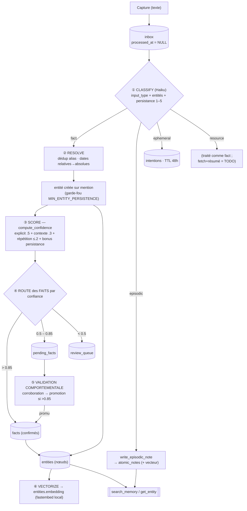
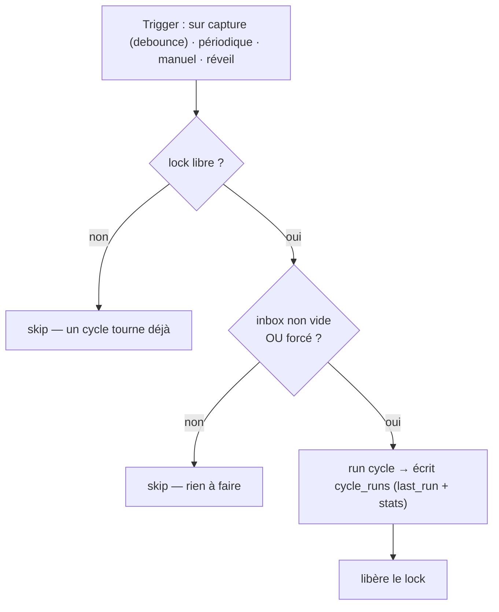
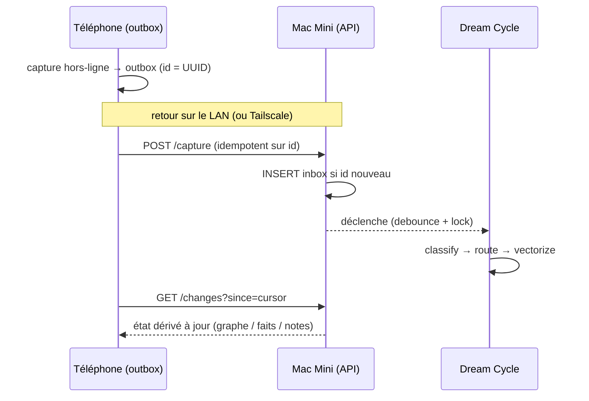

# Synapse — Spec technique actuelle (prod)

> Architecture réelle du système : ce qui tourne aujourd'hui. Les pistes restantes sont listées en §9–§10.

Philosophie : **« capture passive, traitement actif »**, **100 % local-first, 0 % cloud**. On capture tout (texte), une IA (Claude Haiku) nettoie/relie/structure, une base locale rend le tout consultable et mémorisable durablement.

---

## 1. Topologie de déploiement

Un **cerveau** (Mac Mini, toujours allumé) ; les autres appareils sont des **répliques en lecture + une outbox de captures**. Aucun cloud : synchro sur le LAN, ou via Tailscale (réseau privé chiffré) en déplacement.

Règles :
- **Un seul processeur** (le Mini) fait tourner le Dream Cycle et écrit l'état dérivé (entités/faits/notes). Évite la divergence multi-maître.
- Les **captures** remontent de partout, append-only, **clé = UUID** → conflit-free.
- L'**état dérivé** redescend en lecture seule → flux à sens unique, rien à fusionner.
- Chaque appareil garde une **copie locale complète** → consultation **hors-ligne, partout**. Seule la *transformation* des nouvelles captures attend de joindre le Mini.

---

## 2. Flux de traitement — le Dream Cycle

Un seul cycle, par entrée d'inbox. Claude classe l'entrée puis route selon `input_type`.

Code : [dream_cycle/cycle.py](../dream_cycle/cycle.py). Déclenché par `python -m dream_cycle` ou le tool MCP `run_dream_cycle`.

---

## 3. Les leviers réglables (vision fonctionnelle)

| Levier | Où | Valeur | Effet |
|---|---|---|---|
| Barème persistance 1–5 | prompt classify | rubrique fixe | définit permanent ↔ bruit ; nourrit confiance + (futur) oubli |
| Poids de confiance | `compute_confidence` | .5 / .3 / ≤.2 / bonus | ↑ consolide vite (+ faux positifs) ; ↓ prudent |
| **`MIN_ENTITY_PERSISTENCE`** | `step4_route` | **2** | garde-fou anti-pollution : ↑ = moins d'entités (plus strict) ; 1 = crée pour tout ce qui est mentionné |
| Seuil consolidation `T_high` (faits) | `step4_route` | 0.85 | un **fait** > 0.85 est confirmé direct ; sinon pending (l'entité, elle, est créée sur mention) |
| Seuil pending `T_pending` | `step4_route` | 0.5 | borne basse « à valider » vs digest |
| TTL intentions | `handle_intentions` | 48h | durée des rappels éphémères |
| memory_strength | épisodique | 1.0 (figé) | *(Phase C)* oubli gracieux |
| Confiance validation manuelle | `validate_fact` | 0.95 | certitude quand l'utilisateur confirme |
| Seuil distance graphe | visualiseur | 1.1 | densité du graphe |
| Modèle d'embedding | `config.py` | MiniLM multilingue 384-d | qualité/langue de la similarité |

> ℹ️ Depuis le découplage : l'**entité** est créée dès la 1ʳᵉ mention (si elle passe `MIN_ENTITY_PERSISTENCE` ou est dans une relation). Ses **faits**, eux, restent en pending tant qu'ils n'atteignent pas 0.85 (1ʳᵉ mention ≈ 0.75) → confirmés à la 2ᵉ mention ou par validation manuelle.

---

## 4. Modèle de données

SQLite (`~/.synapse/synapse.db`), ouvert via `apsw`, extension `sqlite-vec`. Schéma : [db/__init__.py](../db/__init__.py).

| Table | Rôle | Niveau mémoire |
|---|---|---|
| `inbox` | captures brutes (`processed_at` NULL → à traiter) | working (TTL 7j *prévu*) |
| `atomic_notes` (+`atomic_notes_vec`) | mémoire épisodique ; cols `summary`, `entities_mentioned`, `memory_strength` | épisodique |
| `entities` / `facts` / `relations` | graphe sémantique (ids = UUID) | sémantique (∞) |
| `pending_facts` / `review_queue` | faits à valider / digest | — |
| `intentions` | éphémère (TTL 48h) | — |
| `validation_events` | journal append-only des validations (durable, réplicable) | — |
| `cycle_runs` | 1 ligne par run du cycle (stats `/dream-cycle/last`) | — |
| `resources` | ressources (réservé) | — |
| `knowledge_graph` | legacy, **inutilisé** | — |

Embeddings : **fastembed local** (ONNX, `paraphrase-multilingual-MiniLM-L12-v2`, 384-d, L2-normalisé). Pas d'appel API pour embedder. Notes dans `atomic_notes_vec` (vec0) ; entités en BLOB (`entities.embedding`) recherchées par cosinus manuel.

---

## 5. Déclenchement du cycle — garde-fous

Le cycle est **idempotent** (ne traite que l'inbox non traitée) → sûr à relancer. On déclenche **par condition, pas par horloge**.

- **Sur arrivée de captures** (principal) : ✅ implémenté — scheduler interne à l'API, debounce `SYNAPSE_CYCLE_DEBOUNCE_SECONDS` (déf. 120s), activé par `SYNAPSE_AUTO_CYCLE=1`. Un batch synchronisé = un cycle. Sert aussi de rattrapage au démarrage (entrées en file → run après le debounce).
- **Filet périodique** (`launchd` ~3h) : complément hors-process, no-op si inbox vide → rattrapage si l'API n'a pas tourné.
- **Maintenance nocturne** (futur) : 1×/jour (decay, compression, digest) ; inoffensif si manqué.
- **Manuel** : bouton « Déclencher maintenant ».
- Verrous : **lock mono-instance** + **`cycle_runs.last_run`**. Sur macOS, `launchd` > `cron` (rattrape au réveil). Seul le Mini planifie.

---

## 6. Outils MCP (existant)

`add_to_inbox` · `search_memory` (vecteur notes + entités, fusion par score ; fallback texte) · `list_recent` · `run_dream_cycle` · `get_entity` · `list_pending` · `validate_fact`. Code : [mcp_server/server.py](../mcp_server/server.py).

---

## 7. API HTTP (implémentée — `api/app.py`, `python -m api`)

Sur le Mini (FastAPI, port 8000), auth **bearer token** (`SYNAPSE_API_TOKEN` ; auth désactivée si non défini = dev), LAN/Tailscale. Les 10 endpoints sont implémentés ; les formes de réponse incluent des champs réservés non encore remplis (`memory_strength`, etc.). Contrat machine : [`openapi.json`](../openapi.json).

| Endpoint | Rôle |
|---|---|
| `GET /health` | ping + statut (pour l'indicateur « Mac · 12ms ») |
| `POST /capture` | capture ; **idempotent sur `id` (UUID client)** ; body `{id, device_id, captured_at, content, type, source}` |
| `GET /feed?limit=` | captures récentes + **statut** (queued / processed / failed) |
| `GET /graph?mode=ego&entity=&depth=` | nœuds (entités) + arêtes (relations), `mention_count`, type, `memory_strength` |
| `GET /entity/{id}` | détail entité : facts, relations, aliases, summary, stats |
| `GET /pending` | faits à valider : question lisible + **citation source** + confiance |
| `POST /pending/{id}/validate` | `{confirmed, correction?}` → stocké comme **événement** |
| `POST /dream-cycle/run` | déclenche le cycle (avec lock) |
| `GET /dream-cycle/last` | dernier run : date, nb notes, nb entités, nb pending (écran Réglages) |
| `GET /changes?since=<cursor>` | réplication : descend l'état dérivé mis à jour vers les répliques |

---

## 8. Modèle de synchronisation

Décisions verrouillées (rendent le multi-Mac possible plus tard, sans le coûter maintenant) :
1. Chaque capture porte `id` (UUID client) + `device_id` + `captured_at`.
2. `POST /capture` **idempotent** sur l'`id` (reprise offline sans doublon).
3. Les **validations sont des événements** append-only (pas un simple UPDATE) → survivent à une reconstruction, se répliquent.
4. L'état dérivé est **reconstructible** depuis inbox + événements de validation.

---

## 9. État d'implémentation

**Implémenté** : Dream Cycle unifié (fact / episodic / ephemeral) · création d'entités sur mention + garde-fou · embeddings locaux · `search_memory` notes + entités · schéma épisodique · API HTTP + modèle de sync (UUID, idempotence, validations-événements, `/changes`) · résilience par entrée + statut de capture · tests hors-ligne (`test_embeddings.py`, `test_cycle.py`, `test_api.py`).

**Pistes restantes** :

| Domaine | Piste |
|---|---|
| Traitement | résolution de coréférence (fenêtre de contexte récent) |
| Traitement | `resource` : fetch + résumé d'URL |
| Traitement | multi-format (image / vision) |
| Mémoire | TTL inbox |
| Mémoire | `memory_strength` (décroissance d'Ebbinghaus / oubli gracieux) |
| Mémoire | compression des `atomic_notes` anciennes |
| Mémoire | digest périodique de la `review_queue` |

---

## 10. Roadmap

Directions backend (sans dates) :
- **Oubli gracieux** — calculer `memory_strength` (décroissance d'Ebbinghaus), compresser/archiver les notes épisodiques anciennes.
- **Ressources** — fetch + résumé d'URL dans `resources`.
- **Coréférence** — résoudre pronoms/références via une fenêtre de contexte récent.
- **Digest** — remonter les éléments faible-confiance de `review_queue`.
- **Découverte LAN** — mDNS/Bonjour pour que les clients trouvent le serveur sans URL manuelle.

Les clients (mobile/desktop) vivent dans un projet séparé et consomment cette API HTTP.
