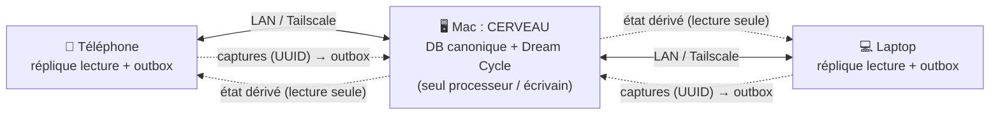
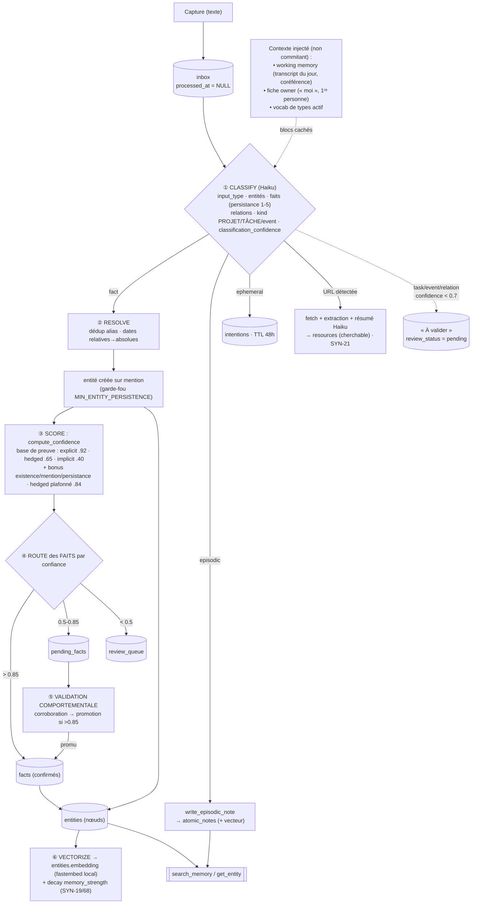
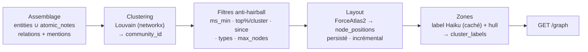
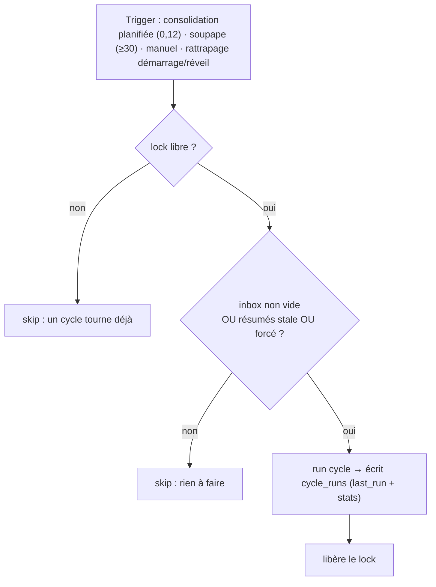
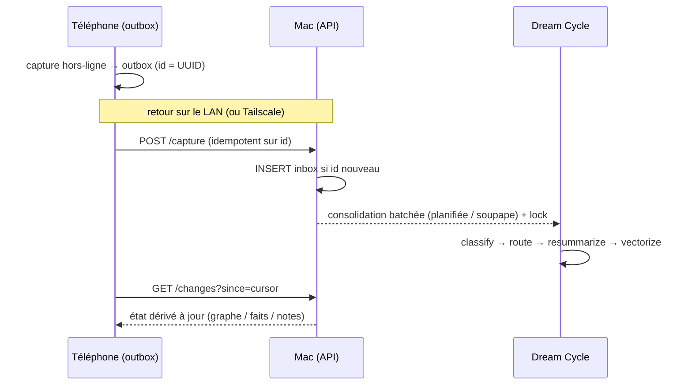

# Synapse : Spec technique actuelle (prod)

> Architecture réelle du système : ce qui tourne aujourd'hui. Les pistes restantes sont listées en §12, §13.

Philosophie : **« capture passive, traitement actif »**, **100 % local-first, 0 % cloud**. On capture tout (texte), une IA (Claude Haiku) nettoie/relie/structure, une base locale rend le tout consultable et mémorisable durablement.

---

## 1. Topologie de déploiement

Un **cerveau** (Mac, toujours allumé) ; les autres appareils sont des **répliques en lecture + une outbox de captures**. Aucun cloud : synchro sur le LAN, ou via Tailscale (réseau privé chiffré) en déplacement.

Règles :
- **Un seul processeur** (le Mac « cerveau ») fait tourner le Dream Cycle et écrit l'état dérivé (entités/faits/notes). Évite la divergence multi-maître.
- Les **captures** remontent de partout, append-only, **clé = UUID** → conflit-free.
- L'**état dérivé** redescend en lecture seule → flux à sens unique, rien à fusionner.
- Chaque appareil garde une **copie locale complète** → consultation **hors-ligne, partout**. Seule la *transformation* des nouvelles captures attend de joindre le cerveau.
- **Isolation LAN** : chaque installation porte un bearer token propre (`SYNAPSE_API_TOKEN`) ; le backend n'est joignable qu'avec lui (auth désactivée = dev seulement).

---

## 2. Flux de traitement : le Dream Cycle

Un seul cycle, par entrée d'inbox. Claude classe l'entrée puis route selon `input_type`. **Le routage est non-exclusif** : une même capture peut produire à la fois des entités, une note atomique, une entrée projet, une intention et une ressource (`_process_entry`).

Code : le moteur vit dans le **cœur Rust partagé `synapse-core`** (§2ter) ; [dream_cycle/cycle.py](../dream_cycle/cycle.py) est l'orchestrateur hôte (boucle, Batch API, day context, clé). Déclenché par la consolidation batchée (§2bis), `python -m dream_cycle`, ou le tool MCP `run_dream_cycle`.

**Résilience par entrée** : chaque entrée est traitée isolément. Une `anthropic.APIError` (clé absente/invalide, réseau) **avorte le run entier** et laisse les entrées en file pour un retry ; une erreur de contenu sur une entrée la marque `status='failed'` (raison dans `inbox.error`, exposée sur `/feed`) et le run continue.

---

## 2bis. Deux temporalités : working memory + consolidation batchée (SYN-93)

Comme la consolidation du sommeil : la capture **bufferise** pendant la « journée », le traitement tourne en une **passe batchée** (« sommeil »).

- **Working memory (coréférence)** : `_build_day_context` fournit au classifieur un **transcript en lecture seule** du batch + des captures récemment consolidées (fenêtre 24h) sous forme de **bloc caché**. « il / elle / ce projet / hier » se résout **d'une capture à l'autre** au lieu de classer chaque entrée dans le vide. Le bloc **ne commit rien** : seule la capture courante produit des sorties.
- **Déclenchement batché** : le scheduler (`api/app.py::_should_consolidate`) ne tourne plus toutes les ~2 min. Les captures attendent une **heure locale planifiée** (`SYNAPSE_CONSOLIDATION_HOURS`, défaut `"0,12"` = minuit + midi, deux fois par jour) **ou** une **soupape de taille** (`SYNAPSE_CONSOLIDATION_MAX_QUEUED`, défaut 30).
- **Rattrapage (laptops testeurs)** : la passe planifiée n'est pas un « tir à l'heure pile » : elle tourne si le dernier créneau planifié est passé et qu'on n'a pas consolidé depuis (persisté via un marqueur `last_consolidation` dans `SYNAPSE_HOME`). Un créneau manqué parce que le Mac dormait est rattrapé au tick suivant du scheduler, **y compris le tout premier au démarrage**. Miroir du self-heal du digest.
- **Batch API (-50 %)** : la passe planifiée classe tout le batch via la **Message Batches API** (`_batch_classify`, classify-only : submit → poll → results). `_classify_params`/`_parse_classify_text` sont partagés avec le chemin synchrone. Sélection : `_should_consolidate` renvoie `'scheduled'` → batch, `'valve'`/`'stale'` → synchrone (immédiateté). Best-effort : tout échec submit/poll retombe en synchrone, le cycle ne cale jamais.

> Conséquence assumée : une requête en milieu de journée ne voit pas les captures non encore consolidées tant que le batch n'a pas tourné. `SYNAPSE_CYCLE_DEBOUNCE_SECONDS` est **legacy/inutilisé** depuis SYN-93.

---

## 2ter. Le cœur Rust partagé : `synapse-core` (SYN-96)

Depuis l'epic SYN-96 (T1→T5), **le cerveau est compilé une seule fois** (repo public `synapse-core`, Apache-2.0) et consommé partout : ce backend via une wheel PyO3 (`synapse_core`), les apps mobiles via UniFFI — zéro divergence de logique entre plateformes, l'iPhone/Android route les captures **on-device** avec exactement ce moteur.

Répartition :

| Dans le core (Rust) | Côté hôte (ce repo, Python) |
|---|---|
| Schéma SQLite + **seule** bibliothèque SQLite du process (sqlite-vec compilé) | API HTTP + MCP (surfaces) |
| Embeddings (fastembed/ort, vecteurs bit-identiques) | Orchestrateur du cycle (`cycle.py` : boucle, erreurs par entrée) |
| Classification (HTTP Anthropic) + **routing complet** (`routing.rs`) | Batch API (SDK anthropic) + working memory (day context) |
| Decay Ebbinghaus (`decay.rs`) · resummary + synthèse projet (`summaries.rs`) | Résolution de clé + fuel proxy (`_llm_args`, SYN-105) |
| Digest hebdo (`digest.rs`) · ressources fetch/extract/résumé (`resources.rs`) | Scheduler (consolidation, self-heal digest), launchd |
| Sync P2P (`sync.rs`, §13) · migrations (`migrate.rs`) | Shims à signatures historiques (`facts_store`, `dream_cycle/decay|digest|resources`) |

Invariants :
- **Les prompts sont de la donnée** : versionnés dans le repo core (`prompts/*.md` + manifest), déployés dans `~/.synapse/prompts/` (`SYNAPSE_PROMPTS_DIR`), byte-identiques aux constantes Python historiques. Éditer + redémarrer, pas de recompilation. ⚠ Déployer les prompts AVANT (ou avec) une wheel qui les lit.
- **Parité golden-testée** : `scripts/golden/` rejoue un corpus de classifications enregistrées et compare les écritures normalisées (224 lignes, 13 tables) entre l'implémentation figée (tag `python-legacy`) et le core. À relancer après tout changement de `routing.rs`.
- **Transactions** : ce qui doit s'exécuter dans la transaction du caller est exposé sur la **passerelle SQL** (`conn.insert_fact`, decay, `gather_week`, `add_project_entry`) ; les passes LLM/vecteurs (`Brain`) écrivent sur **leur propre connexion** et s'appellent **hors** `with conn:` (sinon SQLITE_BUSY).

---

## 3. Les leviers réglables (vision fonctionnelle)

| Levier | Où | Valeur | Effet |
|---|---|---|---|
| Barème persistance 1-5 | prompt classify | rubrique fixe | définit permanent ↔ bruit ; nourrit confiance + oubli |
| Base de preuve (confiance) | `compute_confidence` / `_EVIDENCE_BASE` | explicit .92 · hedged .65 · implicit .40 | point de départ selon la force de l'assertion ; + bonus existence/mention/persistance ; hedged plafonné à .84 |
| **`MIN_ENTITY_PERSISTENCE`** | `step4_route` | **2** | garde-fou anti-pollution : ↑ = moins d'entités ; 1 = crée pour tout ce qui est mentionné |
| Seuil consolidation `T_high` (faits) | `step4_route` | 0.85 | un **fait** > 0.85 est confirmé direct ; sinon pending (l'entité, elle, est créée sur mention) |
| Seuil pending `T_pending` | `step4_route` | 0.5 | borne basse « pending » vs `review_queue` |
| **Seuil « À valider »** | `cycle.py` | `SYNAPSE_REVIEW_CONFIDENCE_THRESHOLD` (0.7) | **partagé** tâches/événements + relations (confiance auto-déclarée par le LLM, ≠ des bandes dérivées 0.85/0.5 des faits) |
| Heures de consolidation | scheduler API | `SYNAPSE_CONSOLIDATION_HOURS` (`"0,12"`) | quand la passe batchée tourne (minuit + midi) : SYN-93 |
| Soupape de taille | scheduler API | `SYNAPSE_CONSOLIDATION_MAX_QUEUED` (30) | force une passe si trop de captures en attente : SYN-93 |
| TTL intentions | `handle_intentions` | 48h | durée des rappels éphémères |
| **memory_strength decay** | core `decay.rs` (shim `dream_cycle/decay.py`) | τ = `SYNAPSE_DECAY_TAU_DAYS` (30j) | oubli gracieux Ebbinghaus sur **notes + entités** (SYN-19/68) |
| Seuil attache-projet | `cycle.py` | `_PROJECT_ATTACH_THRESHOLD_DEFAULT` (0.30) | proposition (non-forçante) tâche/intention → projet existant (point 1 C, abaissé de 0.55) |
| Attraction intra-cluster (carte) | `graph_layout.py` | `_INTRA_COMMUNITY_PULL` (3×) | cohésion spatiale des communautés au layout |
| Plafond de nœuds renvoyés (carte) | `GET /graph` | `max_nodes` (1000) | anti-hairball : ne renvoie jamais plus que les N plus saillants |
| **Seuil merge embedding** | `_propose_merge_by_embedding` | `SYNAPSE_MERGE_EMBEDDING_THRESHOLD` (0.85) | fusion auto de doublons (SYN-61) |
| **Prédicats single-valued** | core `routing.rs` (`SINGLE_VALUED_PREDICATES`) | liste statique | last-writes-wins / obsolescence (SYN-37) |
| Confiance validation manuelle | `validate_fact` | 0.95 | certitude quand l'utilisateur confirme |
| Modèle d'embedding | `config.py` | MiniLM multilingue 384-d | qualité/langue de la similarité |

> ℹ️ Depuis le découplage : l'**entité** est créée dès la 1ʳᵉ mention (si elle passe `MIN_ENTITY_PERSISTENCE` ou est dans une relation). Ses **faits**, eux, restent en pending tant qu'ils n'atteignent pas 0.85 → confirmés à la 2ᵉ mention ou par validation manuelle.

---

## 4. Validation humaine : la file « À valider »

Tout ce qui est **incertain n'est jamais jeté silencieusement** : c'est mis de côté, caché des vues de lecture, et proposé à la confirmation. Une file unique, plusieurs sources :

| Bucket | Condition | Où c'est stocké | Surfacé par | Confirmer / Rejeter |
|---|---|---|---|---|
| Faits pending | `compute_confidence` ∈ 0.5-0.85 | `pending_facts` | `GET /pending` | `POST /pending/{id}/validate` |
| Faits review | `compute_confidence` < 0.5 | `review_queue` | (interne) | : |
| **Tâches/événements** | `classification_confidence` < 0.7 | `atomic_notes.review_status='pending'` | `GET /atomic-notes?review_status=pending` | `POST /atomic-note/{id}/confirm` · rejet = `/archive` |
| **Relations** | `confidence` (par relation) < 0.7 | `relations.review_status='pending'` | `GET /relations/pending` | `POST /relation/{id}/confirm` · rejet = `DELETE /relation/{id}` |
| **Attache-projet** | similarité tâche/intention ↔ projet ≥ 0.30 | `project_attach_proposals` | `GET /project-attach-proposals` | `.../accept` · `.../reject` |
| Types d'entité | type hors vocab actif | `entity_type_proposals` (`status='pending'`) | `GET /entity-type-proposals` | `POST .../accept|reject` (SYN-58) |
| Fusion d'entités | doublon substring/embedding | `entity_merge_proposals` | `GET /merge-proposals` | `POST .../accept|reject` (SYN-39/61) |

Les éléments `pending` sont **exclus de toutes les surfaces de lecture** (listes par défaut, `/graph`, `/changes`, digest, régénération de résumé) tant qu'ils ne sont pas confirmés : un « à valider » ne peut pas polluer la mémoire ni l'embedding avant validation. Côté app : segments **Tâches** et **Liens** dans l'onglet « À valider ».

> Durcissement classifieur (2026-06-29) : Haiku est fragile sur la frontière tâche-vs-éphémère (phrasé bref / 2ᵉ personne / traduit). Règle dure ajoutée : **toute ACTION À FAIRE ⇒ `atomic_note` de `kind="task"`** (adressée à une personne/org nommée ou portant un engagement/délai = tâche, jamais éphémère, même en deux mots). L'« éphémère trivial » est restreint au sans-contenu/sans-destinataire. La règle couvre le chemin batch (même prompt).

---

## 5. Le graphe explicite : faits vs relations (2026-06-30)

**Une relation = un fait dont l'objet est une entité nommée → plus de « redite ».** « Audric est le cousin d'Alexis » produisait AVANT et un fait (`is_cousin_of="Alexis"` sur Audric) ET une relation (Audric→Alexis). Désormais :
1. **Règle de prompt** : si l'objet d'un fait est une entité nommée que tu émets aussi, n'émets QUE la relation.
2. **De-dup défensif** dans `step4_route` : un fait dont la `value` matche la cible d'une relation de la même entité est **droppé** (Haiku est faillible, le filet de routage reste). Les faits à valeur littérale (`lives_in="Lyon"`) sont intacts.

La relation est la **forme canonique** : traversable, visible **des deux fiches**. `GET /entity/{id}` renvoie `relations` (sortantes) **et `relations_incoming`** (entrantes) → « Audric → cousin → Alexis » apparaît aussi sur la fiche d'Alexis. La réplique calcule la même chose hors-ligne.

**Relations sous garde de confiance** (elles persistaient en dur avant) : le classifieur émet une `confidence` par relation ; `relations.review_status='pending'` si < 0.7, sinon `'confirmed'`. Cachées de toute lecture tant que non confirmées.

**Dédup de fait sur re-mention (point 3b)** : `insert_fact` (core `routing.rs`, shim `facts_store`) détecte un fait actif identique (même entité+prédicat+valeur, insensible casse/espaces) et le **renforce** (`confidence ← max`, `last_confirmed` bumpé) au lieu de dupliquer la ligne.

> **La sérendipité est intacte** : elle tourne sur un canal séparé : cosinus sur `entity_embedding_text` (nom/type/aliases/attributs/résumé, **jamais faits ni relations**) + embeddings de notes. Le de-dup/gate n'affecte que le graphe explicite ; la proximité implicite (merge-by-embedding 0.85, attache-projet, « entités liées ») est inchangée.

---

## 6. Identité, projets & tâches

- **Owner / « moi » (point 2)** : les captures en 1ʳᵉ personne (« je », « j'ai », « mon », « moi ») se résolvent vers **ta propre entité** au lieu de créer un « auteur » fantôme. L'id owner vit dans `config.json` (`config_store.get_owner_entity_id`) ; `_load_owner_block` injecte un bloc classifieur (non caché) nommant l'owner. Endpoints `GET /owner`, `PUT /owner`.
- **PROJET vs TÂCHE (point 1)** : avant d'émettre `kind="task"`, une règle prioritaire du classifieur tranche : multi-étapes / horizon long = **PROJET** (→ `project_entries` + entité `type="project"`, nommée par domaine durable p.ex. « Escalade » pour que les progrès futurs se re-rattachent au même parapluie) vs tâche bornée = **TÂCHE**. Garde-fou : `type=project` seulement avec un `project_entries` correspondant.
- **Attache-projet → « À valider » (point 1 C/D)** : une tâche/intention proche d'un projet existant (≥ 0.30, avec marge anti-ambiguïté) file une **proposition non-forçante** (`project_attach_proposals`). Manuel : `POST /atomic-note/{id}/promote-to-project`.
- **Agrégat projet (SYN-40)** : `project_entries` (les briques), `project_state` (synthèse courante) + `project_state_versions` (historique). La synthèse s'append puis se refond au-delà d'un seuil de raffinement.

---

## 7. Modèle de données

SQLite (`~/.synapse/synapse.db`), ouvert via `apsw`, extension `sqlite-vec`. Schéma : [db/__init__.py](../db/__init__.py). `init_db()` est idempotent (`CREATE TABLE IF NOT EXISTS` + migrations `ALTER TABLE` best-effort).

| Table | Rôle | Niveau mémoire |
|---|---|---|
| `inbox` | captures brutes (`processed_at` NULL → à traiter) ; `error`, `client_id` (idempotent), `device_id`, `captured_at`, `status` | working |
| `atomic_notes` (+`atomic_notes_vec`) | mémoire épisodique ; `summary`, `entities_mentioned`, `memory_strength`, `kind`, `review_status` | épisodique |
| `entities` / `facts` / `relations` | graphe sémantique (ids = UUID) ; `entities.memory_strength` (decay SYN-68) ; `relations.review_status` | sémantique (∞) |
| `pending_facts` / `review_queue` | faits à valider / à revoir | : |
| `intentions` | éphémère (TTL 48h) | : |
| `validation_events` | journal append-only des validations (durable, réplicable) | : |
| `cycle_runs` | 1 ligne par run du cycle (stats `/dream-cycle/last`) | : |
| `resources` | URL fetchées + résumé + embedding (SYN-21) | sémantique |
| `entity_merge_proposals` | file de dédup d'entités (SYN-39/61) | : |
| `entity_type_proposals` / `active_entity_types` | vocab de types dynamique (SYN-58) | : |
| `project_entries` / `project_state` / `project_state_versions` | agrégat projet (SYN-40) | : |
| **`project_attach_proposals`** | propositions d'attache tâche/intention → projet (point 1 C) | : |
| `node_positions` | cache des positions de la carte (x, y) : ForceAtlas2, SYN-69 | projection (carte) |
| `cluster_labels` | cache des labels Haiku par signature de cluster, SYN-70 | projection (carte) |
| `knowledge_graph` | legacy, **inutilisé** | : |

**Colonnes de cycle de vie** : `entities.status` (active/pending/archived) + `archived_at` ; `facts.archived_at`/`obsoleted_at`/`obsoleted_by` (SYN-37/59) ; `atomic_notes.last_reactivated_at` (decay SYN-19). Vues de lecture filtrent par défaut (`status='active'`, `archived_at IS NULL`, `obsoleted_at IS NULL`).

**Colonnes de provenance inverse (SYN-92)** : `provenance_capture_id` sur `entities`/`facts`/`atomic_notes`/`relations` → `GET /capture/{id}/generated` liste ce que le cycle a produit d'une capture donnée (inverse de la provenance).

**Notes typées (SYN-85/86/23)** : `atomic_notes.kind` ∈ `note|task|event|digest` + `event_date` (date **absolue** résolue par le classifieur), `event_recurring` (récurrence annuelle), `archived_at` (geste user « rendre obsolète », réversible). Une **tâche** est un backlog retrouvable ; depuis SYN-23 elle peut porter une **échéance** (`event_date` sur `kind=task`) **sans devenir un événement** (event = ce qui *se produit* ; task = ce qu'on *fait*). Les notes durables traversent les gates éphémères ; une note routée projet mentionne toujours son projet.

**Catégories de faits (SYN-88)** : `facts.category` ∈ `identity|dates|work|places|relations|preferences|health|other`, propagée par `insert_fact` ; les clients groupent les faits en sections repliables.

**Résumé d'entité dérivé (SYN-89)** : `entities.summary_stale` posé à chaque écriture de fait ; `step_resummarize` régénère le résumé **from scratch depuis les faits ACTIFS + relations** (dérivé, jamais éditable ; règle **intemporelle**, dates absolues). Édition utilisateur = source de vérité : rename (ancien nom → **alias**), correction de fait (`confidence → 1.0`), CRUD relations.

**Embeddings** : **fastembed local** (ONNX, `paraphrase-multilingual-MiniLM-L12-v2`, 384-d, L2-normalisé). Pas d'appel API pour embedder. Notes dans `atomic_notes_vec` (vec0) ; entités en BLOB (`entities.embedding`) recherchées par cosinus manuel. Depuis **SYN-91**, `GET /changes` réplique l'embedding entité en base64 (`embedding_b64`) → le mobile calcule les « entités liées » (cosinus) **hors-ligne**.

---

## 8. Modèle du graphe : la carte vivante (SYN-66)

> La carte mentale n'est **pas** une table de plus : c'est une **projection** assemblée à la demande depuis le graphe existant. Aucune nouvelle source de vérité : juste deux caches (`node_positions`, `cluster_labels`). Un recalcul complet ne perd rien. Exposée par `GET /graph`. Code : [graph_layout.py](../graph_layout.py), [graph_clusters.py](../graph_clusters.py), handler dans [api/app.py](../api/app.py).

**Deux natures de nœuds** : **Entités** (`entities`, id = uuid) : nœuds « durs » ; **Notes atomiques** (`atomic_notes`, id exposé `n:<rowid>`) : pensées libres, reliées sans devenir des entités.
**Deux natures d'arêtes** : **Relations** entité↔entité ; **Mentions** note→entité (dérivées de `entities_mentioned`).

| Variable visuelle | Donnée backend |
|---|---|
| Taille du neurone | `memory_strength` × `degree` |
| Couleur de zone | `community_id` (Louvain) |
| Saturation / vivacité | `memory_strength` (decay Ebbinghaus, SYN-19/68) |
| Forme | `kind` (entity / atomic_note) + `type` |
| Position (x, y) | mobile : **calculée côté client** (`ForceLayout.kt`, portage vis-network forceAtlas2Based, SYN-64) ; backend `node_positions` (ForceAtlas2) = advisory |
| Épaisseur d'arête | `confidence` |

**Décisions de modèle** : projection non source (`relayout=true` reconstruit tout) · stabilité (positions relues telles quelles, nouveau nœud placé près du barycentre de son cluster) · layout client sur mobile (calculé une fois puis figé, offline) · coût LLM négligeable (labels batchés + cachés par signature) · anti-hairball serveur (`max_nodes` plafonne par saillance) · pas de cluster forcé (< `MIN_CLUSTER_SIZE`=3 → orphelin flottant) · layout sémantique (`semantic_edges` : kNN embeddings top-4 cosinus ≥ 0.80, poids `0.45×score`, **layout-only**). **Dépendance : `networkx>=3.2`** (pur-Python ; package dans le .dmg PyInstaller, contrairement à igraph/leidenalg).

---

## 9. Déclenchement du cycle : garde-fous

Le cycle est **idempotent** (ne traite que l'inbox non traitée) → sûr à relancer. On déclenche **par condition, pas par horloge**.

- **Consolidation batchée (SYN-93)** : scheduler interne à l'API (`SYNAPSE_AUTO_CYCLE=1`) : passe planifiée à `SYNAPSE_CONSOLIDATION_HOURS` (`"0,12"`) ou soupape `SYNAPSE_CONSOLIDATION_MAX_QUEUED` (30). Rattrapage démarrage/réveil via le marqueur `last_consolidation`. Passe planifiée = **Batch API** (-50 %) ; soupape/stale = synchrone. Voir §2bis.
- **Résumés stale (SYN-89)** : le cycle tourne aussi sur inbox vide si des résumés d'entités sont à régénérer.
- **Digest hebdo (SYN-23)** : LaunchAgent `fr.myffu.synapse.digest`, **lundi 08h** (`StartCalendarInterval`, `Weekday 1`) → `python -m dream_cycle.digest` écrit une note `kind=digest` par semaine ISO. **Self-heal** : `_ensure_weekly_digest` (boucle scheduler) régénère le digest de la semaine courante s'il manque → un tir manqué pendant que le Mac dormait est rattrapé dans l'heure au réveil.
- **Maintenance** : `decay` en fin de chaque cycle + `python -m dream_cycle.decay` (cron nocturne pour les jours à inbox vide).
- **Manuel** : `POST /dream-cycle/run` (override on-demand).
- Verrous : **lock mono-instance** + **`cycle_runs.last_run`**. Sur macOS, `launchd` > `cron` (rattrape au réveil). Seul le cerveau planifie. Prod = LaunchAgent utilisateur (`fr.myffu.synapse.backend.plist`, `RunAtLoad` + `KeepAlive`, machine-specific, hors repo).

---

## 10. Outils MCP (`mcp_server/server.py`)

`add_to_inbox` · `search_memory` (vecteur notes + entités **+ ressources**, fusion par score ; fallback texte `LIKE`) · `list_recent` · `run_dream_cycle` · `get_entity` (par nom canonique ou alias) · `list_pending` · `validate_fact` (partage `dream_cycle/validation.py` avec l'API). Un hit `search_memory` réactive légèrement les notes surfacées (SYN-19).

---

## 11. API HTTP (`api/app.py`, `python -m api`)

Sur le cerveau (FastAPI, port 8000), auth **bearer token** (`SYNAPSE_API_TOKEN` ; auth désactivée si non défini = dev), LAN/Tailscale. **57 endpoints** ; le contrat gelé est [`openapi.json`](../openapi.json) (à régénérer via `app.openapi()` quand il change : l'app code contre lui).

Familles principales :

| Famille | Endpoints (extrait) |
|---|---|
| Santé / capture | `GET /health` · `POST /capture` (**idempotent sur UUID client**) · `GET /feed` · `POST /inbox/{id}/requeue` · **`POST /inbox/{id}/reprocess`** (rejoue une capture après fix de prompt : supprime ses seuls artefacts, garde les entités) |
| Graphe / carte | `GET /graph` (base entités+relations ; flags `include_notes`, `cluster`, `layout`/`relayout`, `clusters` + filtres `node_types`/`memory_strength_min`/`since`/`top_pct_per_cluster`/`include_isolated`/`max_nodes`) |
| Entités / faits | `GET /entity/{id}` (`?include=archived,obsolete` ; `relations` + `relations_incoming`) · `PATCH /entity/{id}` (rename→alias) · `PATCH /fact/{id}` · `POST/PATCH/DELETE /relation` · `GET /entity/{id}/similar` (SYN-62) · archive/obsolete/restore (SYN-59) |
| « À valider » | `GET /pending` · `POST /pending/{id}/validate` · `GET /atomic-notes?review_status=pending` · `POST /atomic-note/{id}/confirm` · `GET /relations/pending` · `POST /relation/{id}/confirm` · `GET/POST /merge-proposals*` (SYN-39) · `GET/POST /entity-type-proposals*` (SYN-58) · `GET /project-attach-proposals` + accept/reject |
| Notes / projets | `GET /atomic-notes` · `GET /atomic-note/{id}` (+ `provenance_content`) · `POST /atomic-note/{id}/reinforce`·`/date`·`/archive`·`/promote-to-project` · `GET /projects` · `GET /project/{id}/state` · project-entry ops (`/move`, `/attach-to-project`, `/detach`, `/reclassify-as-fact`) |
| Provenance | **`GET /capture/{id}/generated`** (SYN-92) |
| Cycle / digest | `POST /dream-cycle/run` (lock + `cycle_runs`) · `GET /dream-cycle/last` · `POST /digest/run` · `GET /digest/latest` |
| Réplication | `GET /changes?since=` (état dérivé + `embedding_b64` par entité, SYN-91) |
| Config / owner | `GET/PUT /config` · **`PUT /config/anthropic-key`** (accepte un fuel token, SYN-105) · `GET/PUT /owner` |

---

## 12. Client Anthropic + fuel proxy (SYN-105)

`anthropic_client.py` est le **seul** point qui résout « comment appeler le modèle ». Deux consommateurs : le client SDK (`get_client()`, encore utilisé par le chemin Batch API) et les appels LLM du **core** — `cycle.py::_llm_args()` traduit la même résolution en `(api_key, base_url, fuel_token)` passés à `Brain.classify/resummarize/synthesize_project/summarize_digest` et aux ressources.

- Une clé normale (`sk-ant-…`) → appel direct.
- Un **fuel token** de bêta (`syn-fuel-…`) → client pointé sur le **proxy fuel** (Cloudflare Worker, repo séparé `synapse-fuel-proxy/`, déployé à `synapse-fuel-proxy.alexis-raitano.workers.dev`) avec le token en header `x-synapse-token` ; la vraie clé ne vit que sur le Worker. URL bakée (`_DEFAULT_FUEL_BASE_URL`), surchargée par `SYNAPSE_FUEL_BASE_URL` (vide = désactive). Consulté seulement pour les tokens `syn-fuel-`, donc une clé normale est inchangée. Jetable par design : arrêter d'émettre des fuel tokens rend le seam inerte.

> Tout le cycle tourne sur **Haiku** (`CLAUDE_MODEL = "claude-haiku-4-5-20251001"`, `config.py`) : même modèle sur prod et chez chaque testeur (le proxy fuel n'autorise que Haiku, il n'y a pas de « plus gros modèle sur prod »).

---

## 13. Modèle de synchronisation

Décisions verrouillées :
1. Chaque capture porte `id` (UUID client) + `device_id` + `captured_at`.
2. `POST /capture` **idempotent** sur l'`id` (reprise offline sans doublon).
3. Les **validations sont des événements** append-only → survivent à une reconstruction, se répliquent.
4. L'état dérivé est **reconstructible** depuis inbox + événements de validation.

**Depuis SYN-112 (T3), le multi-Mac existe** : le core embarque un moteur de sync maison (`sync.rs`) — `sync_log` HLC par (table, pk, colonne) alimenté par des triggers SQL purs sur les 18 tables répliquées, changesets JSON v1, merge LWW par colonne, tombstones. Transport = **pull mesh** (`api/sync_peers.py` : `GET /sync/changes`, `POST /sync/pull`, pairs via `SYNAPSE_SYNC_PEERS` + mDNS `_synapse._tcp`, boucle `SYNAPSE_SYNC_INTERVAL`). Le **owner-lock** (`sync_owner`, répliqué) garde un seul Dream Cycle dans le mesh — un `POST /dream-cycle/run` non-owner reçoit 409 ; `dedup_after_pull()` rattrape un double-routage.

---

## 14. État d'implémentation & pistes restantes

**Implémenté** : **cœur Rust partagé** `synapse-core` (SYN-96 T1→T5 : schéma + embeddings + classif + routing + decay + resummary/synthèse + digest + ressources, prompts en data, parité golden 224/224 ; desktop via wheel PyO3, mobile on-device via UniFFI) · **sync P2P multi-Mac** (SYN-112 : HLC + LWW par colonne, pull mesh, owner-lock) · Dream Cycle unifié (routing **non-exclusif**) · **two-timescale** working memory + consolidation batchée + Batch API (SYN-93) · création d'entités sur mention + garde-fou · **file « À valider »** unifiée (tâches, relations, attache-projet, types, fusions) · **faits vs relations** de-dup + gating + fiche bidirectionnelle · **owner/« moi »** + **PROJET-vs-TÂCHE** · embeddings locaux · `search_memory` notes + entités + ressources · carte vivante (Louvain + ForceAtlas2 + zones) · API HTTP **57 endpoints** + modèle de sync · **provenance inverse** (SYN-92) · **reprocess** d'une capture · **digest hebdo** (SYN-23, lundi 08h + self-heal) · **entités liées offline** (SYN-91) · client Anthropic + fuel proxy (SYN-105) · résilience par entrée · tests hors-ligne (verts).

**Pistes restantes** :

| Domaine | Piste |
|---|---|
| Traitement | multi-format (image / vision) · app bilingue (prompt + UI, SYN-108 ; le STT suit déjà la langue clavier) |
| Projets | refinement actif via MCP · exhumation · élagage dégressif de l'historique de synthèse |
| Mémoire | TTL inbox · compression des `atomic_notes` éteintes · digest périodique de la `review_queue` |
| Sync | delta-sync des embeddings quand la base grossit (mDNS/Bonjour : fait, SYN-112) |
| Carte | Leiden/igraph si besoin · concave/alpha hulls · détection de cluster émergent |

Les clients (mobile/desktop) vivent dans un projet séparé et consomment cette API HTTP.
